# ShopEase 🛍️

A full-stack, role-based e-commerce platform with AI-powered product insights, secure payments, and a complete production-grade DevOps pipeline — containerized, monitored, and deployed via automated CI/CD.

**Live Demo:** [shopease-app-neon.vercel.app](https://shopease-app-neon.vercel.app)  |  **Backend:** Render


> **Note:** The AWS EC2-hosted DevOps infrastructure (Jenkins, Prometheus, Grafana, live production deployment) was built and demonstrated as a proof-of-concept. Since EC2 free-tier credits expire, that instance is not kept running 24/7 — all automation is fully scripted and reproducible from a fresh instance in minutes (see [Infrastructure](#infrastructure-as-code) below). The live e-commerce app itself remains permanently accessible via the Vercel/Render deployment linked above.

---


## Table of Contents

- [Overview](#overview)
- [Features](#features)
- [Tech Stack](#tech-stack)
- [Demo Credentials](#demo-credentials)
- [Architecture](#architecture)
- [DevOps Pipeline](#devops-pipeline)
  - [Containerization](#containerization)
  - [Reverse Proxy](#reverse-proxy)
  - [Infrastructure as Code](#infrastructure-as-code)
  - [Configuration Management](#configuration-management)
  - [Monitoring](#monitoring)
  - [CI/CD](#cicd)
- [Local Development Setup](#local-development-setup)
- [Project Structure](#project-structure)
- [Environment Variables](#environment-variables)

---


## Overview

ShopEase is a role-based (Buyer/Seller) e-commerce platform built as a full MERN-stack application, later extended with a complete DevOps automation layer to simulate a production deployment pipeline end-to-end — from infrastructure provisioning to continuous deployment and monitoring.

## Features

- 🔐 JWT-based authentication with role-based access (Buyer / Seller)
- 🛒 Product management, cart, wishlist, and order history
- ⭐ AI-generated product review summaries via Gemini API
- 💳 Razorpay payment gateway integration
- 🎨 Responsive UI built with React, Redux, and TailwindCSS
- 📦 Fully containerized with Docker Compose
- 🔁 Automated CI/CD pipeline with Jenkins
- 📊 Live infrastructure monitoring with Prometheus + Grafana


## Tech Stack

**Application:** JavaScript, React, Node.js, Express.js, MongoDB, Redux, TailwindCSS, Gemini API, Razorpay
**DevOps:** Docker, Docker Compose, Nginx, Terraform, Ansible, Jenkins, Prometheus, Grafana, AWS EC2, GitHub Webhooks

---


## Architecture

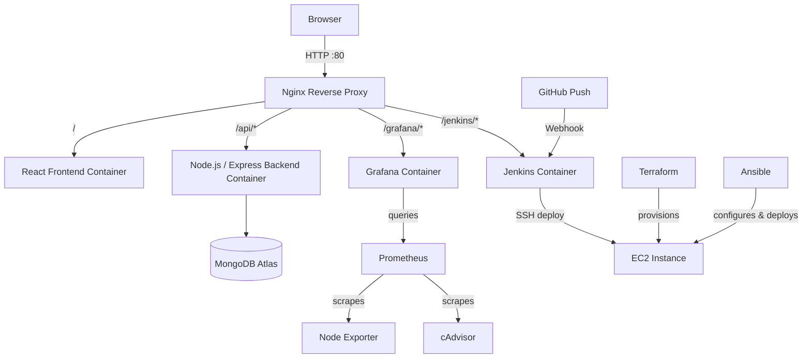


All 7 services (frontend, backend, node-exporter, cadvisor, prometheus, grafana, jenkins) run as Docker containers on a single EC2 instance, behind one Nginx reverse proxy — a single public IP routes to every service by path (`/`, `/api`, `/grafana`, `/jenkins`).

---


## DevOps Pipeline


### Containerization

The frontend and backend are each built into separate Docker images via multi-stage Dockerfiles, orchestrated with a single `docker-compose.yml`. Backend and internal services (Prometheus, node-exporter, cAdvisor) are **not** exposed directly to the host — only Nginx (port 80) is publicly reachable, and it routes internally over the Docker Compose network by service name.

## 🔹 Docker Compose Container Orchestration Status

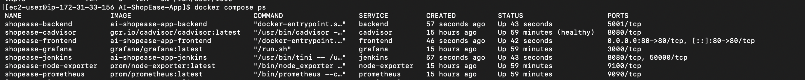


### Reverse Proxy

A single Nginx container is the only public entry point. It routes requests by path prefix to the appropriate internal service:


| Path         | Routed To                              |
| ------------ | -------------------------------------- |
| `/`          | React frontend (static + SPA fallback) |
| `/api/*`     | Express backend                        |
| `/grafana/*` | Grafana dashboard                      |
| `/jenkins/*` | Jenkins CI/CD dashboard                |


### Infrastructure as Code

AWS EC2 infrastructure (instance, security group, AMI selection) is fully defined in Terraform — a single `terraform apply` provisions a ready-to-configure server, and `terraform destroy` tears it down cleanly with zero manual AWS console steps.

##  🔹 Terraform Apply Output

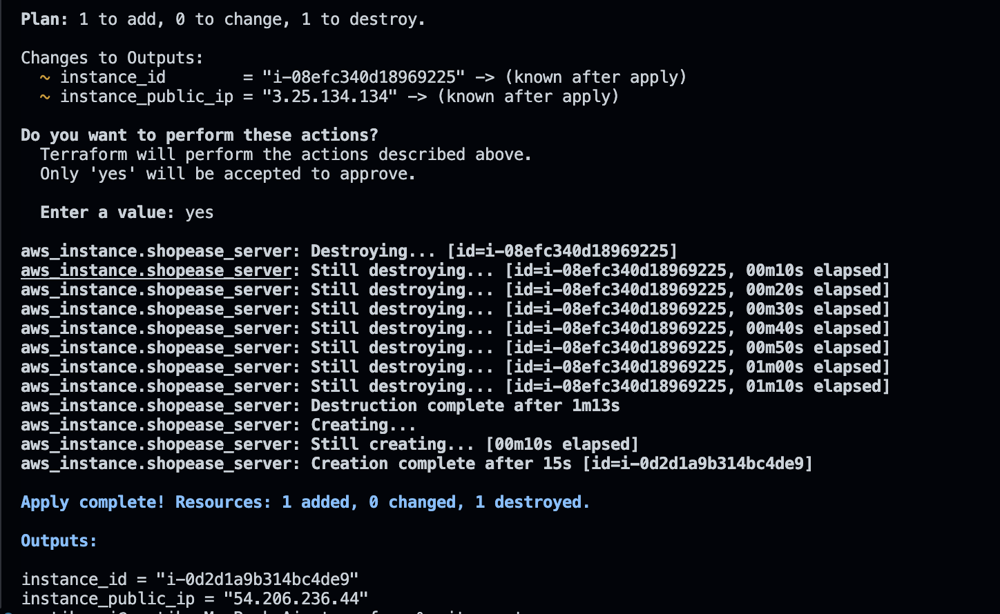

## 🔹 Terraform Apply Result

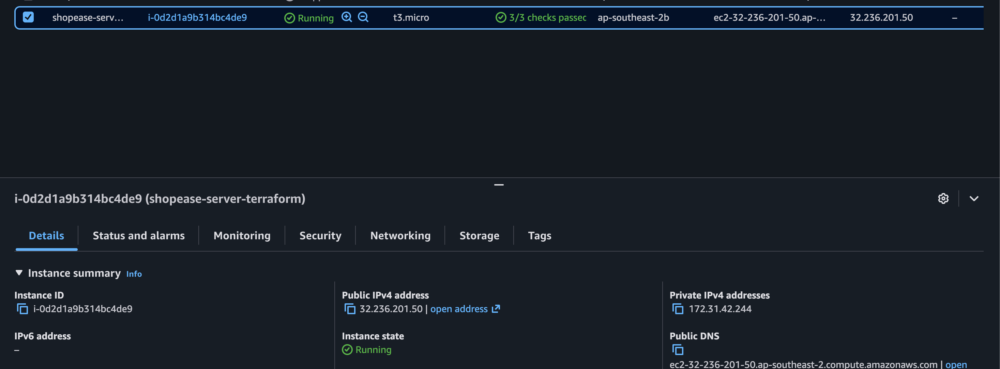

## 🔹 Terraform Destroy Output

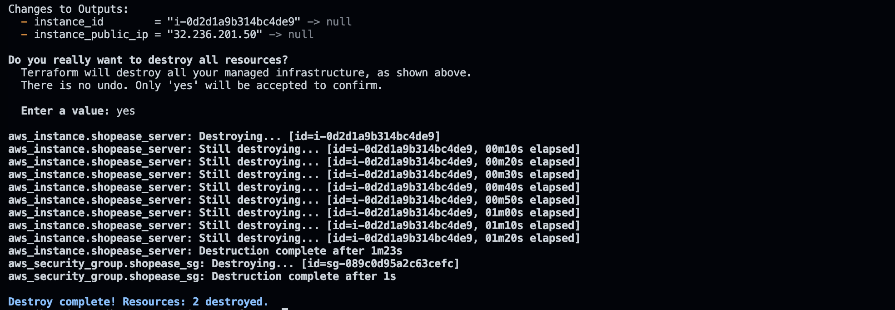

## 🔹  EC2 Termination 

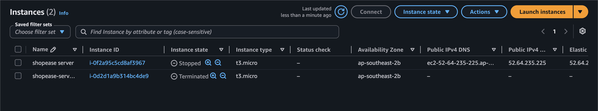


### Configuration Management

Once an instance exists, an Ansible playbook takes it from bare OS to a fully running application with a single command:

- Installs Docker, Docker Compose plugin, and Docker Buildx (versions fetched dynamically via GitHub API — no hardcoded versions)
- Clones the repository
- Copies environment secrets (gitignored, never committed)
- Runs `docker compose up -d --build`
- Verifies the app is actually responding (health check with retries) before reporting success

The playbook is fully idempotent — re-running it against an already-configured server safely reports `ok` on unchanged steps instead of re-doing work.

## 🔹 Ansible Playbook Execution - Part 1

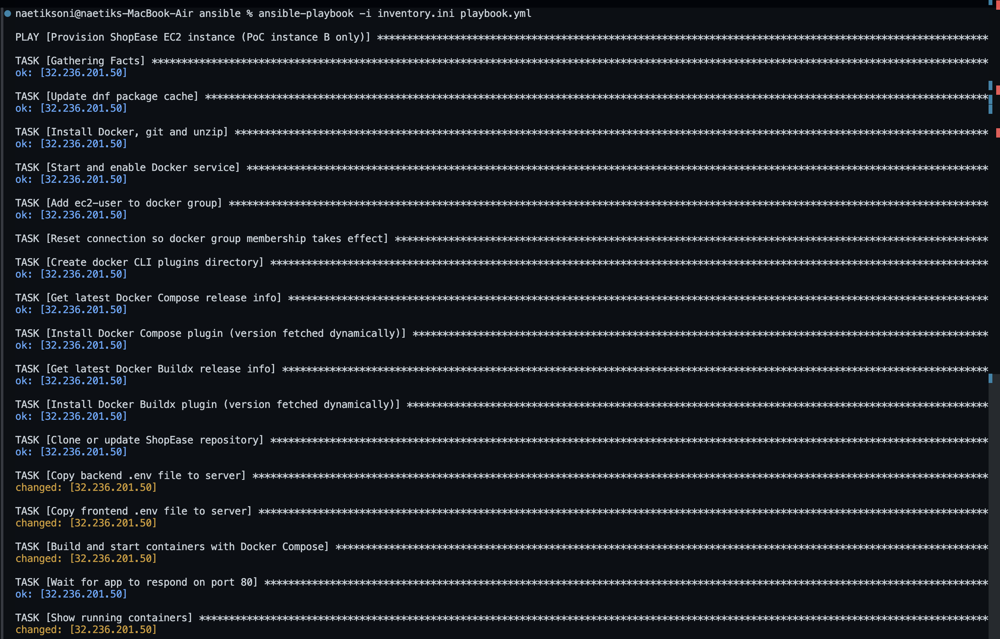

## 🔹 Ansible Playbook Execution - Part 2

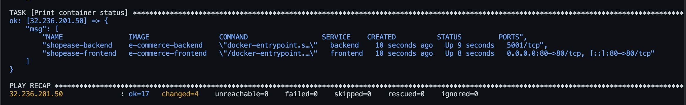


### Monitoring

Prometheus scrapes metrics every 15 seconds from:

- **Node Exporter** — host-level metrics (CPU, memory, disk, network)
- **cAdvisor** — per-container resource usage

Grafana visualizes this data through two dashboards, both routed through the same Nginx reverse proxy at `/grafana`.


## 📊 Grafana Dashboards Overview

This view shows the imported and configured dashboard targets inside the Grafana instance, mapping host performance metrics and container resource utilization directly from Prometheus.

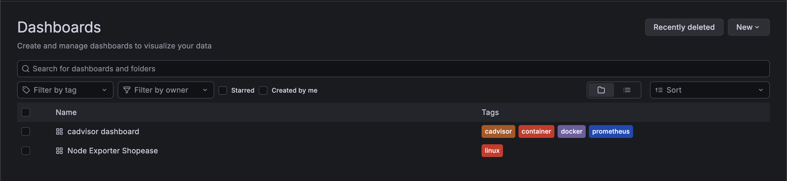

---

## 🔹 Grafana Node Exporter Dashboard (Host Metrics) Part 1

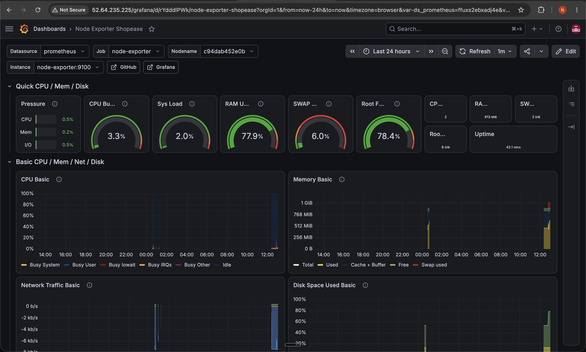

## 🔹 Grafana Node Exporter Dashboard (Host Metrics) Part 2

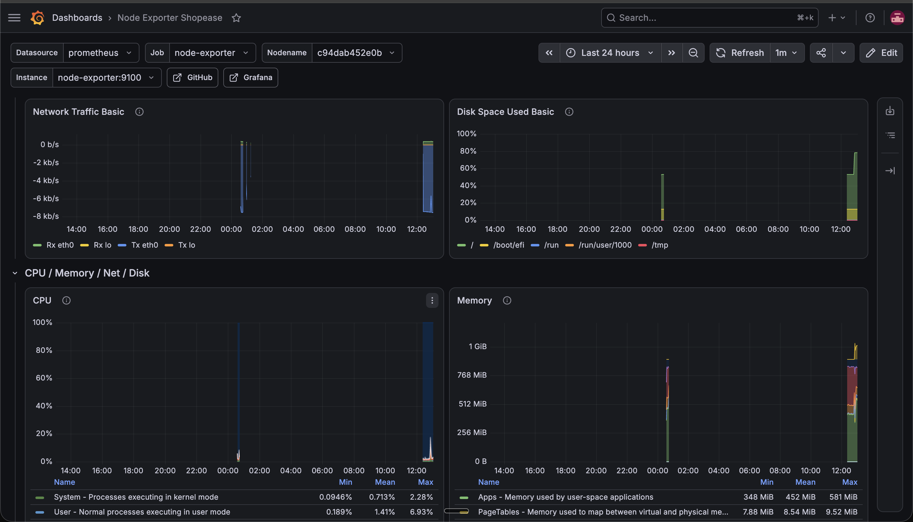


## 🔹 Grafana cAdvisor Dashboard (Per-Container Metrics)

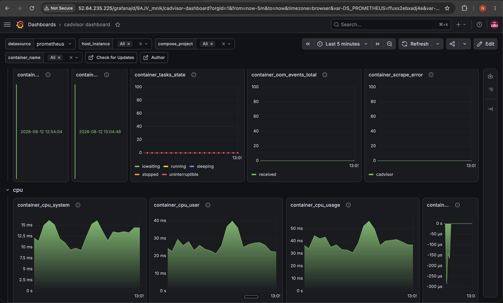


### CI/CD

A Jenkins pipeline, triggered automatically via a GitHub webhook on every push to `master`, runs:

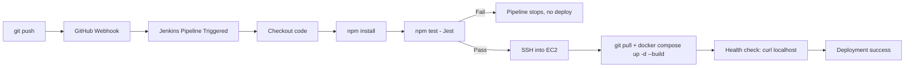


- **Trigger:** GitHub webhook (real push-to-deploy, not polling)
- **Test stage:** Runs the Jest test suite — a failing test blocks deployment entirely
- **Deploy stage:** SSHes into the EC2 instance using a Jenkins-managed credential, pulls latest code, and rebuilds containers
- **Verification:** Confirms the app actually responds on port 80 before marking the pipeline successful

## 🔹 Jenkins Pipeline - Successful Stage View

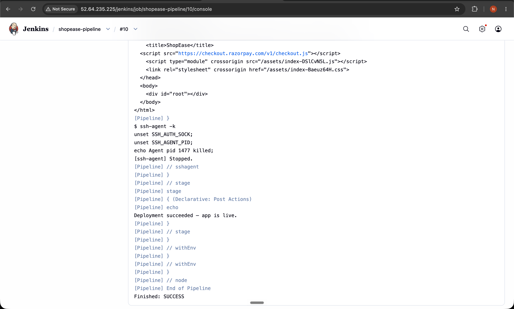

## 🔹 Jenkins Webhook Trigger Verification

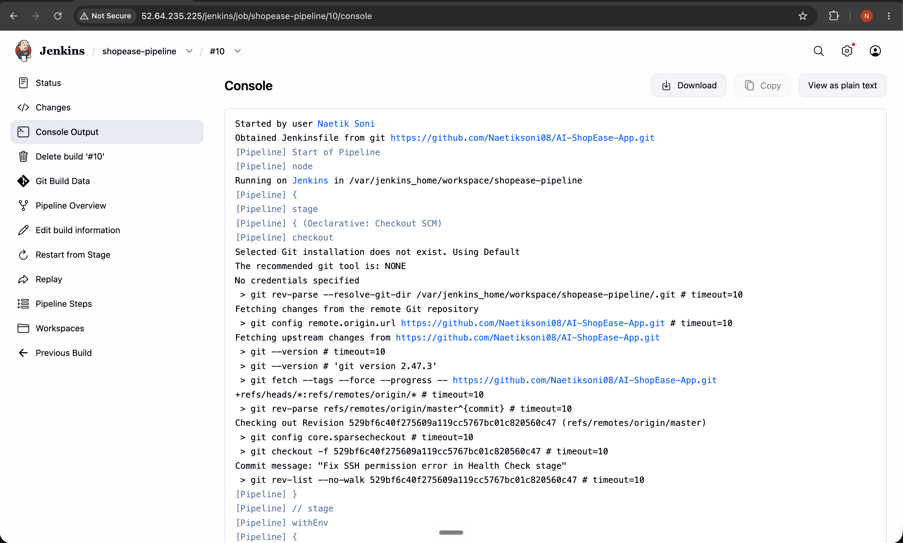


---


## Local Development Setup

```bash
git clone https://github.com/Naetiksoni08/AI-ShopEase-App.git
cd AI-ShopEase-App

# Backend
cd Backend
npm install
npm run dev

# Frontend (new terminal)
cd Frontend
npm install
npm run dev
```

Or run the full stack with Docker Compose:

```bash
docker compose up --build
```


## Demo Credentials


| Role   | Username        | Password     |
| ------ | --------------- | ------------ |
| Buyer  | `buyer_demo`    | `Buyer@123`  |
| Seller | `seller_ananya` | `Seller@123` |
| Seller | `seller_rohan`  | `Seller@123` |


Two seller accounts are provided to demonstrate the "My Products" filtering feature, which scopes product listings to the logged-in seller.

---


## 📁 Project Structure

```text
AI-ShopEase-App/
├── Backend/                 # Express API, Jest tests
│   └── tests/
├── Frontend/                # React + Vite + Redux
|   ├── nginx.conf           # Reverse proxy routing rules
├── ansible/                 # Server provisioning & deployment automation
│   ├── playbook.yml
│   ├── inventory.ini
│   └── group_vars/
├── terraform/               # AWS EC2 infrastructure as code
│   └── main.tf
├── prometheus/              # Metrics scrape config
│   └── prometheus.yml
├── docker-compose.yml       # Full service orchestration (7 services)
├── Jenkinsfile              # CI/CD pipeline definition
├── jenkins.Dockerfile       # Custom Jenkins image (Node.js added)
└── README.md
```

---


## 🔑 Environment Variables

The application requires configuration files to be created locally before deployment. Ensure you create a `.env` file in both the `Backend/` and `Frontend/` directories as specified below:

### 🔹 Backend Configuration

Create a `.env` file inside the `Backend/` directory:

```env
mongoDbURL=your_mongodb_connection_string
JWT_SECRET=your_jwt_secret_key
GEMINI_API_KEY=your_google_gemini_api_key
RAZORPAY_KEY_ID=your_razorpay_key_id
RAZORPAY_KEY_SECRET=your_razorpay_key_secret
```


### 🔹 Frontend Configuration

Create a `.env` file inside the `Frontend/` directory:

```env
VITE_API_URL=
```

*(Note: Left blank on purpose for production deployment. The frontend routes requests natively via relative paths using the Nginx reverse proxy architecture).*

---

> 🚀 **Note:** This setup was built as a comprehensive, full end-to-end DevOps engineering project — showcasing modern architectural standards across application code, immutable infrastructure as code (IaC), automated configuration management, container orchestration, metrics monitoring, and continuous integration/continuous deployment (CI/CD).


---


## Known Limitations & Future Enhancements

This project prioritizes demonstrating a complete DevOps pipeline over production-scale hardening. A few deliberate trade-offs and gaps, in no particular order:

**Infrastructure & Reliability**
- Single EC2 instance runs all 7 services — no load balancing or horizontal scaling; the
  instance is a single point of failure by design (acceptable for a portfolio project, not
  for real production traffic)
- Terraform state is stored locally, not in a remote backend (S3 + DynamoDB locking) — fine
  solo, but would cause conflicts with multiple engineers applying changes
- No blue-green or canary deployment strategy — Jenkins deploys directly overwrite the
  running containers; a bad deploy causes brief downtime rather than a safe rollback

**Security**
- No HTTPS/SSL — Nginx currently serves over plain HTTP (port 80) only; would need a domain
  + Let's Encrypt (Certbot) for a real production certificate
- Secrets are managed via gitignored `.env` files, not a dedicated secrets manager (AWS
  Secrets Manager / HashiCorp Vault)

**Monitoring**
- Prometheus + Grafana provide dashboards only — no Alertmanager configured, so there's no
  automated notification (Slack/email) if a metric crosses a threshold

**Application**
- Product images are added via pasted URLs rather than file upload — no image hosting
  (S3/Cloudinary) or upload pipeline
- No pagination on the reviews list — all reviews for a product load at once (fine at
  current scale, would need cursor-based pagination for high-review-count products)
- No automated end-to-end/integration tests — current test suite covers isolated unit logic
  (validators, rating calculation) rather than full request/response flows

---

### Planned Enhancements
- [ ] HTTPS via Let's Encrypt once a custom domain is attached
- [ ] Migrate Terraform state to an S3 backend with DynamoDB state locking
- [ ] Add Prometheus Alertmanager with Slack/email notifications
- [ ] Add image upload support via Cloudinary or S3 pre-signed URLs


## License

This project is licensed under the [MIT License](LICENSE).
